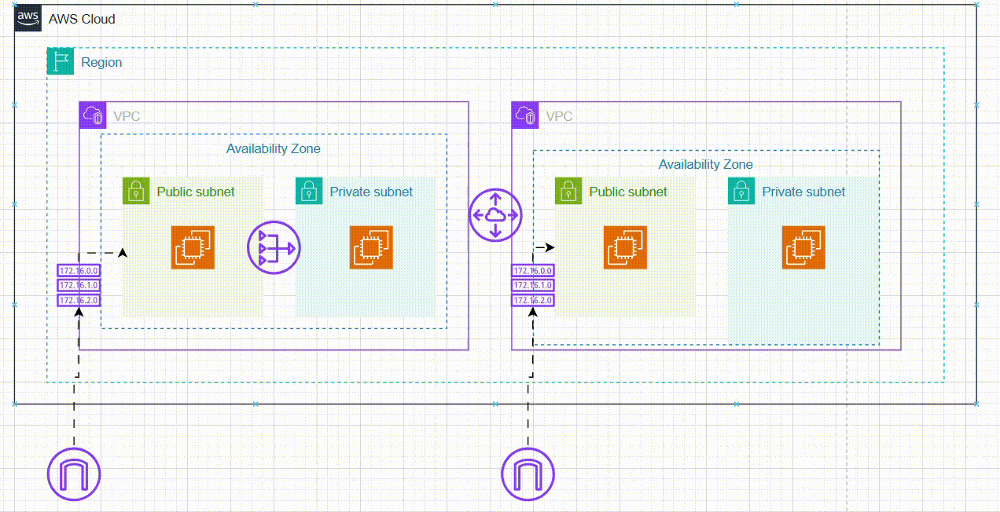

# My AWS Networking Project: Building a Scalable VPC Infrastructure from Scratch

**Author:** Prashant Gohel
**Date:** September 9, 2025

---

### **Table of Contents**
1. [My Project's Goal](#1-my-projects-goal)
2. [Core Concepts: The "What & Why"](#2-core-concepts-the-what--why)
3. [The Step-by-Step Guide I Followed](#3-the-step-by-step-guide-i-followed)
    * [Part 1: Building My First VPC ('test-vpc')](#part-1-building-my-first-vpc-test-vpc)
    * [Part 2: Creating a Second, Isolated VPC ('production-vpc')](#part-2-creating-a-second-isolated-vpc-production-vpc)
    * [Part 3: Connecting VPCs with Peering](#part-3-connecting-vpcs-with-peering)
    * [Part 4: Creating a Secure Private Subnet with a NAT Gateway](#part-4-creating-a-secure-private-subnet-with-a-nat-gateway)
4. [Critical Final Step: Cleaning Up My AWS Resources](#4-critical-final-step-cleaning-up-my-aws-resources)
5. [Final Thoughts and Conclusion](#5-final-thoughts-and-conclusion)

---

### **1. My Project's Goal**

For this project, I focused on learning the core **networking** concepts in AWS by building a complete cloud setup from scratch. My main aim was to go beyond single-server setups and understand how to design secure and isolated environments that can communicate privately with each other.

Here’s what I planned to do:
1. Create two separate Virtual Private Clouds (VPCs) to represent `test` and `production` environments.
2. Launch EC2 instances (virtual servers) inside each VPC.
3. Configure **internet access** securely for public-facing servers.
4. Set up **VPC Peering** to allow private and secure communication between the two VPCs.
5. Build a **private subnet** for backend services (like databases) that can access the internet for updates but are protected from incoming connections.

Lastly, I made sure to learn how to properly delete all resources in the right order to avoid unnecessary AWS charges and keep my account clean.

---

### **2. Core Concepts: The "What & Why"**

Before diving into the steps, I wanted to solidify my understanding of the key components I would be working with.

* **What is a VPC (Virtual Private Cloud)?** A VPC is **your own private and isolated network** within the AWS cloud. You can think of it like owning a separate piece of land where you decide what to build and how it connects to the outside world. By default, everything inside your VPC is fully isolated — it **doesn’t communicate with the internet** or other VPCs unless you allow it. This gives you complete control over your network’s security, access, and traffic flow.

* **What is a Subnet?** A Subnet is **a smaller section within a VPC**. If the VPC is like your piece of land, then a Subnet is like dividing that land into specific areas or rooms. You can create **public subnets** that **connect** directly **to the internet** or **private subnets** that stay isolated and are used for internal resources. This helps organize your network and control which parts are accessible from outside and which remain secure inside.

* **What is an Internet Gateway (IGW)?** An Internet Gateway is the **main entry and exit point** that allows resources in your VPC **to communicate with the internet**. It acts like a secure doorway to the outside world. When you attach an IGW to your VPC and configure the routing properly, **instances in public subnets can send and receive data from the internet**. Without an IGW, your VPC remains fully isolated with no external connectivity.

* **What is a Route Table?** A Route Table is a set of rules that **control how network traffic moves within your VPC**. It decides where data from your subnets should go. For example, if a subnet needs internet access, its route table must include a route (`0.0.0.0/0`) that directs all internet-bound traffic to the Internet Gateway. In simple terms, it acts like a map or guide that tells your VPC where to send each piece of network traffic.

* **What is a NAT Gateway?** A NAT (Network Address Translation) Gateway is an AWS service that **allows instances in a private subnet to access the internet securely**, without being exposed to incoming traffic. It’s placed in a public subnet and acts like a one-way bridge — private servers can connect outward (for tasks like software updates), but no one from the internet can directly connect back to them. This helps maintain both functionality and security in your network design.

---

### **3. The Step-by-Step Guide I Followed**

#### **Part 1: Building My First VPC ('test-vpc')**
My first step was to create the `test` environment.

1.  **VPC Creation:** In the AWS VPC dashboard, I chose to create a "VPC only" to manually configure each component.
    * **Name:** `test-vpc`
    * **IPv4 CIDR:** `10.0.0.0/16`. I chose this because it's a standard private IP range and the `/16` gives me a massive pool of 65,536 IPs, which is more than enough for any project.
2.  **Subnet Creation:** I created a public subnet within my VPC.
    * **Name:** `test-public-subnet`
    * **CIDR:** `10.0.0.0/24`. I carved out a smaller `/24` block (256 IPs) from my VPC's range for this specific subnet.
3.  **Internet Gateway (IGW):** I created an IGW named `test-igw` and, crucially, **attached** it to my `test-vpc`.
4.  **Route Table:** I created a route table named `test-public-rt`.
    * I first associated it with my `test-public-subnet`.
    * Then, I edited its routes and added the most important rule for public access: **Destination:** `0.0.0.0/0` (anywhere on the internet) -> **Target:** my `test-igw`.
5.  **EC2 Instance Launch:** I launched a `t2.micro` Ubuntu instance, making sure to place it inside my `test-vpc` and `test-public-subnet`. The most critical setting was to **Enable** "Auto-assign Public IP." Without this and the IGW/Route Table setup, I would have no way to SSH into my server from the internet.

#### **Part 2: Creating a Second, Isolated VPC ('production-vpc')**
I repeated the exact same process to create my `production` environment, but with different names and, most importantly, a different IP range to prevent any overlap.
* **VPC Name:** `production-vpc` with CIDR `192.168.0.0/16`
* **Subnet Name:** `production-public-subnet` with CIDR `192.168.0.0/24`

At this point, I had two EC2 instances in two completely separate VPCs that had no knowledge of each other.

#### **Part 3: Connecting VPCs with Peering**

My goal here was to allow the test instance to communicate with the production instance using their private IP addresses, simulating a secure backend connection.

1.  **Create Peering Connection:** In the VPC dashboard, I created a peering connection, naming it `test-to-prod-peering`. I set `test-vpc` as the "requester" and `production-vpc` as the "accepter."
2.  **Accept the Request:** I then had to find the pending request and formally accept it to activate the connection.
3.  **Update Route Tables (Crucial Step):** The connection doesn't work until you tell the VPCs how to use it.
    * In the `test-public-rt`, I added a route: **Destination:** `192.168.0.0/16` (the entire Production VPC) -> **Target:** the Peering Connection.
    * In the `production-public-rt`, I added the reverse route: **Destination:** `10.0.0.0/16` (the entire Test VPC) -> **Target:** the same Peering Connection.
4.  **Update Security Groups:** The final step was to update the instance firewalls (Security Groups). I allowed `All ICMP` (ping) traffic, but instead of allowing it from anywhere, I set the **Source** to be the CIDR block of the *other* VPC. This ensures that only instances within my peered VPC can communicate, not the entire internet.

After this, I successfully pinged the private IP of my production instance from my test instance.

#### **Part 4: Creating a Secure Private Subnet with a NAT Gateway**

This was the final piece of the infrastructure, designed for backend servers.

1.  **Private Subnet Creation:** I created a new subnet in my `test-vpc` named `test-private-subnet` with a non-overlapping CIDR of `10.0.1.0/24`.
2.  **NAT Gateway Creation:** I created a NAT Gateway named `test-nat-gw`. Critically, I placed it **inside my public subnet** (`test-public-subnet`) and allocated a new Elastic IP for it, as it needs a public IP to function.
3.  **Private Route Table:** I created a new route table, `test-private-rt`, and associated it with my `test-private-subnet`.
4.  **Configure Private Routing:** The key to making this work was the route I added to `test-private-rt`: **Destination:** `0.0.0.0/0` -> **Target:** my newly created **NAT Gateway**.

This setup means any instance launched in my private subnet (without a public IP) will route its internet-bound traffic through the NAT Gateway, allowing it to download updates securely.

---

### **4. Critical Final Step: Cleaning Up My AWS Resources**

To avoid any charges, I learned that I must delete resources in a specific order, because of their dependencies.
1.  **EC2 Instances:** Terminate all instances first.
2.  **NAT Gateway:** This must be deleted before the VPC. Deleting it also releases its costly Elastic IP.
3.  **Peering Connection, IGWs, Subnets, and Route Tables:** I deleted all the networking components.
4.  **VPCs:** Finally, with everything inside them gone, I could delete the VPCs themselves.

---

### **5. Final Thoughts and Conclusion**

This project was an incredible deep dive into AWS networking. By building everything manually, I moved beyond theory and gained a practical understanding of how to design and implement a secure, scalable, and interconnected cloud environment. Mastering these concepts is essential for any cloud or DevOps role, and this hands-on experience has been invaluable.
  
